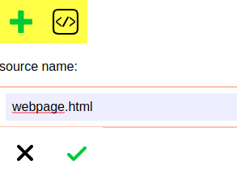
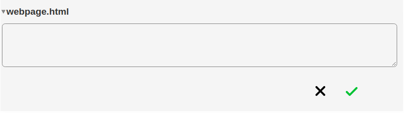

# Hosting a Web Page On Your Pod

### Introduction

This hack enables you to host traditional web pages on your Solid pod.  Solid is 100% backwards compatible with the existing web.  Hosting a webpage on your pod couldn't be easier.  It can either be a normal HTML page.  Or interactive using JavaScript.

### The Hack

Browse to your solid pod.  Now, go to your public folder and click the green + sign on your [databrowser](https://github.com/solid/userguide) and click the source icon.



This will create a file webpage.html in your folder.  Expand webpage.html and hover over the top which will give you the ability to edit the source.



In the textbox type in something \(or paste\) something suitably kitch.  Example

```text
<h2>Hello</h2>

Solid World!
```

And click the green tick.  Congratulations, you have now published your first web page to solid!

### Demo

[https://solidhacks.solid.community/public/demos/webpage.html](https://solidhacks.solid.community/public/demos/webpage.html)

### Exercises

For fun, try and create some of the short files here, using only copy and paste!

[http://aem1k.com/](http://aem1k.com/)

### 

