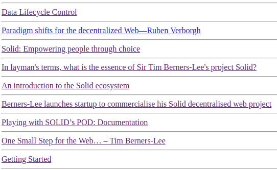

# Hosting Snippets



### Introduction

This hack allows you to host snippets of code and display them in realtime.  It is built in the same way as the Saving a Markdown.  It builds on the following 2 hacks.

> [https://solid.gitbook.io/solid-hacks/section-1/creating-a-realtime-markdown-editor](https://solid.gitbook.io/solid-hacks/section-1/creating-a-realtime-markdown-editor)

> [https://solid.gitbook.io/solid-hacks/section-1/url-shortening](https://solid.gitbook.io/solid-hacks/section-1/url-shortening)

### The Hack

In a similar way to creating a markdown editor create a minimalist code pen using the following code.

```text
<body id=e><a href=..>Home</a><script>for(i=4;--i;)e.innerHTML+="<textarea id=t"+i+" placeholder="+[,"JS","CSS","HTML"][i]+" rows=9 onkeydown='if((K=event).keyCode==9){K.preventDefault();s=this.selectionStart;this.value=this.value.substring(0,this.selectionStart)+\"\t\"+this.value.substring(this.selectionEnd);this.selectionEnd=s+1}'>"+(unescape((l=location).hash.slice(1,-1)).split("\x7F")[i-1]||"");onload=onkeyup=function(a){q=[(E=escape)(j=t1[v="value"]),E(c=t2[v]),E(h=t3[v])].join("\x7f")+1;(H=history)&&H.replaceState?H.replaceState(0,0,"#"+q):location.hash=q;I=h||c||j?h+"<script>"+j+"<\/script><style>"+c:"<pre>Result";navigator.userAgent.match(/IE|Tr/)?((D=e.lastChild.contentWindow.document).write(I),D.close()):frames[0].location.replace("data:text/html,"+escape(I))}</script><style>html,body{height:100%}*{box-sizing:border-box;-moz-box-sizing:border-box;margin:0;vertical-align:top}textarea,iframe{border:1px solid}textarea{resize:none;width:33.333%;height:40%;*width:32%}iframe{width:100%;height:60%}a{position:absolute;bottom:0;right:0;background:#555;color:#fff;text-decoration:none;padding:0px 5px}</style><iframe>
```

Save it as `snippet.html` It should look something like this.

> [https://solidhacks.solid.community/public/demos/snippet.html](https://solidhacks.solid.community/public/demos/snippet.html)

Next we're going to use the query string to shorten some code.  Create a shortened url, `neon.html`

With the following long URL :

\`\`[`https://solidhacks.solid.community/public/demos/snippet.html#.text-effect%20%7B%0A%20%20overflow%3A%20hidden%3B%0A%20%20position%3A%20relative%3B%0A%20%20-webkit-filter%3A%20contrast%28110%25%29%20brightness%28190%25%29%3B%0A%20%20%20%20%20%20%20%20%20%20filter%3A%20contrast%28110%25%29%20brightness%28190%25%29%3B%0A%7D%0A%0A.neon%20%7B%0A%20%20position%3A%20relative%3B%0A%20%20background%3A%20black%3B%0A%20%20color%3A%20transparent%3B%0A%7D%0A.neon%3A%3Abefore%2C%20.neon%3A%3Aafter%20%7B%0A%20%20content%3A%20attr%28data-text%29%3B%0A%20%20color%3A%20white%3B%0A%20%20-webkit-filter%3A%20blur%280.02em%29%3B%0A%20%20%20%20%20%20%20%20%20%20filter%3A%20blur%280.02em%29%3B%0A%20%20position%3A%20absolute%3B%0A%20%20top%3A%200%3B%0A%20%20left%3A%200%3B%0A%20%20pointer-events%3A%20none%3B%0A%7D%0A.neon%3A%3Aafter%20%7B%0A%20%20mix-blend-mode%3A%20difference%3B%0A%7D%0A%0A.gradient%2C%0A.spotlight%20%7B%0A%20%20position%3A%20absolute%3B%0A%20%20top%3A%200%3B%0A%20%20left%3A%200%3B%0A%20%20bottom%3A%200%3B%0A%20%20right%3A%200%3B%0A%20%20pointer-events%3A%20none%3B%0A%20%20z-index%3A%2010%3B%0A%7D%0A%0A.gradient%20%7B%0A%20%20background%3A%20linear-gradient%2845deg%2C%20red%2C%20blue%29%3B%0A%20%20mix-blend-mode%3A%20multiply%3B%0A%7D%0A%0A.spotlight%20%7B%0A%20%20-webkit-animation%3A%20light%205s%20infinite%20linear%3B%0A%20%20%20%20%20%20%20%20%20%20animation%3A%20light%205s%20infinite%20linear%3B%0A%20%20background%3A%20radial-gradient%28circle%2C%20white%2C%20transparent%2025%25%29%200%200/25%25%2025%25%2C%20radial-gradient%28circle%2C%20white%2C%20black%2025%25%29%2050%25%2050%25/12.5%25%2012.5%25%3B%0A%20%20top%3A%20-100%25%3B%0A%20%20left%3A%20-100%25%3B%0A%20%20mix-blend-mode%3A%20color-dodge%3B%0A%7D%0A%0A@-webkit-keyframes%20light%20%7B%0A%20%20100%25%20%7B%0A%20%20%20%20-webkit-transform%3A%20translate3d%2850%25%2C%2050%25%2C%200%29%3B%0A%20%20%20%20%20%20%20%20%20%20%20%20transform%3A%20translate3d%2850%25%2C%2050%25%2C%200%29%3B%0A%20%20%7D%0A%7D%0A%0A@keyframes%20light%20%7B%0A%20%20100%25%20%7B%0A%20%20%20%20-webkit-transform%3A%20translate3d%2850%25%2C%2050%25%2C%200%29%3B%0A%20%20%20%20%20%20%20%20%20%20%20%20transform%3A%20translate3d%2850%25%2C%2050%25%2C%200%29%3B%0A%20%20%7D%0A%7D%0A.neon%20%7B%0A%20%20font%3A%20700%20220px%20%27Lato%27%2C%20sans-serif%3B%0A%20%20text-transform%3A%20uppercase%3B%0A%20%20text-align%3A%20center%3B%0A%20%20margin%3A%200%3B%0A%7D%0A.neon%3Afocus%20%7B%0A%20%20outline%3A%20none%3B%0A%20%20border%3A%201px%20dotted%20white%3B%0A%7D%0A%0Abody%20%7B%0A%20%20background%3A%20black%3B%0A%20%20display%3A%20flex%3B%0A%20%20min-height%3A%20100vh%3B%0A%20%20justify-content%3A%20center%3B%0A%20%20align-content%3A%20center%3B%0A%20%20align-items%3A%20center%3B%0A%7D%0A%3Cdiv%20class%3D%22text-effect%22%3E%0A%20%20%3C%21--%20Select%20the%20text%20in%20the%20preview%20and%20type%20in%20your%20own%20--%3E%0A%20%20%3Ch1%20class%3D%22neon%22%20data-text%3D%22Solid%22%20contenteditable%3ESolid%3C/h1%3E%0A%20%20%3Cdiv%20class%3D%22gradient%22%3E%3C/div%3E%0A%20%20%3Cdiv%20class%3D%22spotlight%22%3E%3C/div%3E%0A%3C/div%3E%0A1`](https://solidhacks.solid.community/public/demos/snippet.html#.text-effect%20%7B%0A%20%20overflow%3A%20hidden%3B%0A%20%20position%3A%20relative%3B%0A%20%20-webkit-filter%3A%20contrast%28110%25%29%20brightness%28190%25%29%3B%0A%20%20%20%20%20%20%20%20%20%20filter%3A%20contrast%28110%25%29%20brightness%28190%25%29%3B%0A%7D%0A%0A.neon%20%7B%0A%20%20position%3A%20relative%3B%0A%20%20background%3A%20black%3B%0A%20%20color%3A%20transparent%3B%0A%7D%0A.neon%3A%3Abefore%2C%20.neon%3A%3Aafter%20%7B%0A%20%20content%3A%20attr%28data-text%29%3B%0A%20%20color%3A%20white%3B%0A%20%20-webkit-filter%3A%20blur%280.02em%29%3B%0A%20%20%20%20%20%20%20%20%20%20filter%3A%20blur%280.02em%29%3B%0A%20%20position%3A%20absolute%3B%0A%20%20top%3A%200%3B%0A%20%20left%3A%200%3B%0A%20%20pointer-events%3A%20none%3B%0A%7D%0A.neon%3A%3Aafter%20%7B%0A%20%20mix-blend-mode%3A%20difference%3B%0A%7D%0A%0A.gradient%2C%0A.spotlight%20%7B%0A%20%20position%3A%20absolute%3B%0A%20%20top%3A%200%3B%0A%20%20left%3A%200%3B%0A%20%20bottom%3A%200%3B%0A%20%20right%3A%200%3B%0A%20%20pointer-events%3A%20none%3B%0A%20%20z-index%3A%2010%3B%0A%7D%0A%0A.gradient%20%7B%0A%20%20background%3A%20linear-gradient%2845deg%2C%20red%2C%20blue%29%3B%0A%20%20mix-blend-mode%3A%20multiply%3B%0A%7D%0A%0A.spotlight%20%7B%0A%20%20-webkit-animation%3A%20light%205s%20infinite%20linear%3B%0A%20%20%20%20%20%20%20%20%20%20animation%3A%20light%205s%20infinite%20linear%3B%0A%20%20background%3A%20radial-gradient%28circle%2C%20white%2C%20transparent%2025%25%29%200%200/25%25%2025%25%2C%20radial-gradient%28circle%2C%20white%2C%20black%2025%25%29%2050%25%2050%25/12.5%25%2012.5%25%3B%0A%20%20top%3A%20-100%25%3B%0A%20%20left%3A%20-100%25%3B%0A%20%20mix-blend-mode%3A%20color-dodge%3B%0A%7D%0A%0A@-webkit-keyframes%20light%20%7B%0A%20%20100%25%20%7B%0A%20%20%20%20-webkit-transform%3A%20translate3d%2850%25%2C%2050%25%2C%200%29%3B%0A%20%20%20%20%20%20%20%20%20%20%20%20transform%3A%20translate3d%2850%25%2C%2050%25%2C%200%29%3B%0A%20%20%7D%0A%7D%0A%0A@keyframes%20light%20%7B%0A%20%20100%25%20%7B%0A%20%20%20%20-webkit-transform%3A%20translate3d%2850%25%2C%2050%25%2C%200%29%3B%0A%20%20%20%20%20%20%20%20%20%20%20%20transform%3A%20translate3d%2850%25%2C%2050%25%2C%200%29%3B%0A%20%20%7D%0A%7D%0A.neon%20%7B%0A%20%20font%3A%20700%20220px%20%27Lato%27%2C%20sans-serif%3B%0A%20%20text-transform%3A%20uppercase%3B%0A%20%20text-align%3A%20center%3B%0A%20%20margin%3A%200%3B%0A%7D%0A.neon%3Afocus%20%7B%0A%20%20outline%3A%20none%3B%0A%20%20border%3A%201px%20dotted%20white%3B%0A%7D%0A%0Abody%20%7B%0A%20%20background%3A%20black%3B%0A%20%20display%3A%20flex%3B%0A%20%20min-height%3A%20100vh%3B%0A%20%20justify-content%3A%20center%3B%0A%20%20align-content%3A%20center%3B%0A%20%20align-items%3A%20center%3B%0A%7D%0A%3Cdiv%20class%3D%22text-effect%22%3E%0A%20%20%3C%21--%20Select%20the%20text%20in%20the%20preview%20and%20type%20in%20your%20own%20--%3E%0A%20%20%3Ch1%20class%3D%22neon%22%20data-text%3D%22Solid%22%20contenteditable%3ESolid%3C/h1%3E%0A%20%20%3Cdiv%20class%3D%22gradient%22%3E%3C/div%3E%0A%20%20%3Cdiv%20class%3D%22spotlight%22%3E%3C/div%3E%0A%3C/div%3E%0A1)\`\`

Save it as neon.html and you should have your first saved code snippet on your pod!

### Demo

> [https://solidhacks.solid.community/public/demos/neon.html](https://solidhacks.solid.community/public/demos/neon.html)

**Tip 1** : It is now possible in this way to run arbitrary code in your solid pod, which can interact with other services \(including solid!\).  Here is an example:

> [https://solidhacks.solid.community/public/u/reddit.html](https://solidhacks.solid.community/public/u/reddit.html)

